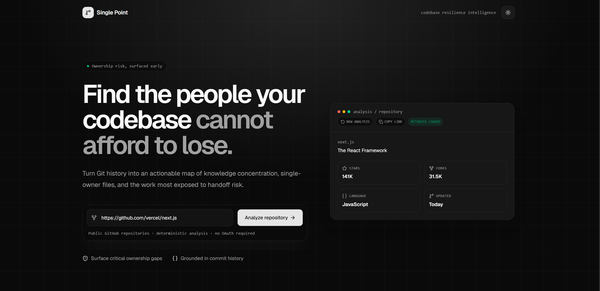
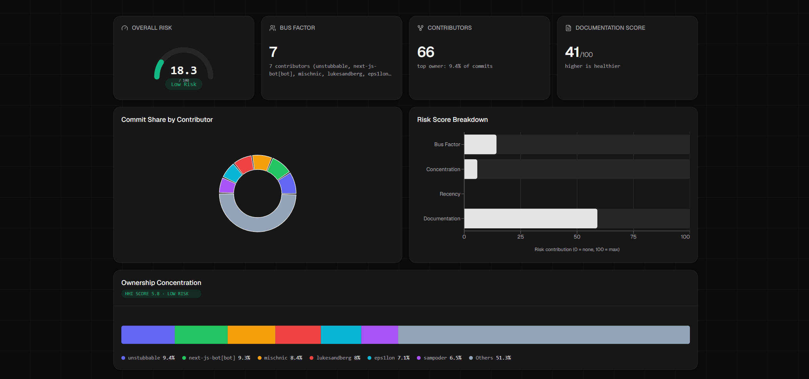
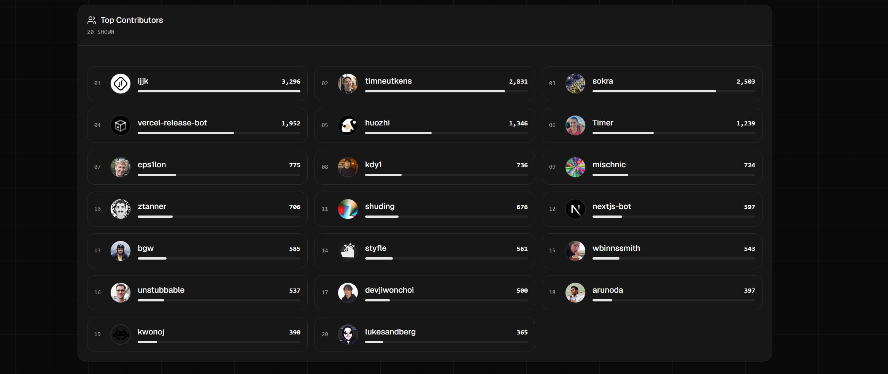
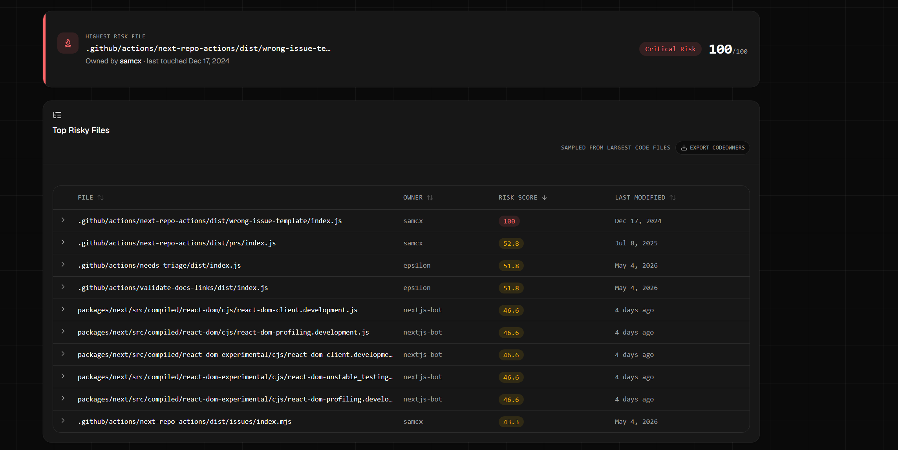
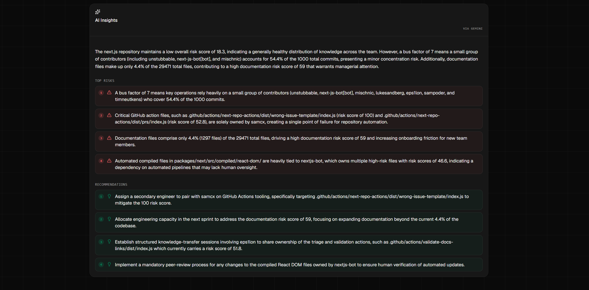
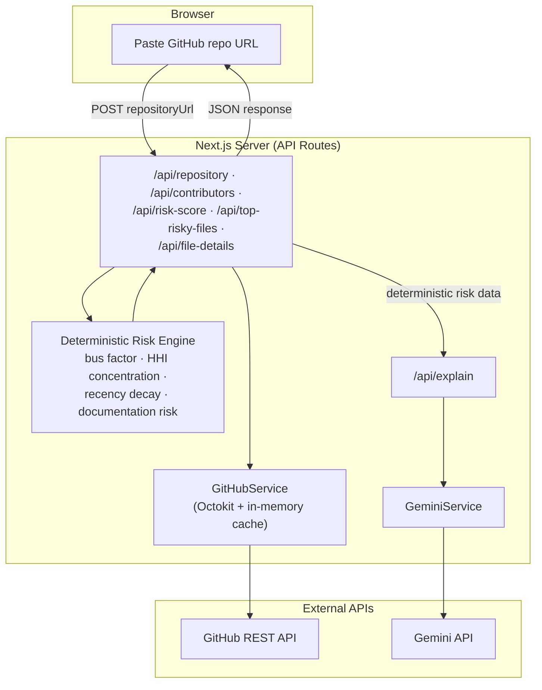

# Single Point

**Find the people your codebase cannot afford to lose.**

Single Point turns a public GitHub repository's commit history into a clear, ranked map of knowledge-concentration risk — which files depend on one person, how exposed your team really is, and what to do about it before it becomes a crisis.

[](https://nextjs.org)
[](https://www.typescriptlang.org)
[](https://tailwindcss.com)
[](https://risk-map-theta.vercel.app)
[](https://risk-map-theta.vercel.app)

🌐 **Live Demo:** https://risk-map-theta.vercel.app
🏆 Built for the **OpenAI × NamasteDev Hackathon**

## 🎥 Demo Video

[](https://drive.google.com/file/d/1pgnkYqmCOx7xuoXUnlqUqt1I62Kka7mL/view?usp=sharing)

---

**A look at the product, top to bottom:**

*The landing page — paste any public GitHub URL and Single Point pulls the real repository data instantly.*
<!--
📸 SCREENSHOT #1 — HERO SHOT
Add here: a full-page screenshot of the landing page with a repo already
analyzed, scrolled to show the hero + the "analysis / repository" preview
card side by side (the very top of the page). This is the first thing
anyone sees when they open the repo, so pick your best-looking run
(e.g. facebook/react or vercel/next.js).
-->


---

## Quick Links

- [Demo Video](#-demo-video)
- [Features](#features)
- [What It Does](#what-it-does)
- [Why This Is Trustworthy, Not Just Another AI Wrapper](#why-this-is-trustworthy-not-just-another-ai-wrapper)
- [Architecture](#architecture)
- [Tech Stack](#tech-stack)
- [Getting Started](#getting-started)
- [How Scoring Works](#how-scoring-works)
- [Known Limitations](#known-limitations)
- [Roadmap](#roadmap)

---

## Features

- 🔍 **Zero-friction analysis** — paste any public GitHub URL, no login or OAuth required
- 📊 **Deterministic risk scoring** — bus factor, ownership concentration, recency, and documentation coverage, combined into one weighted composite score
- 🎯 **Featured highest-risk file** — the single most exposed file in the repository, surfaced automatically
- 📁 **Sortable, drill-down file table** — expand any row to see its full ownership breakdown and commit timeline
- 🤖 **AI-generated insights** — a plain-English summary, top risks, and manager-actionable recommendations, powered by Gemini
- 📄 **One-click CODEOWNERS export** — turns the analysis into a real, ready-to-commit GitHub CODEOWNERS file
- 🌓 **Light and dark themes**, fully responsive, accessible keyboard navigation throughout

---

## What It Does

Every codebase has a **bus factor** — the number of people who could disappear before a project is in real trouble. Most teams have no idea what theirs is.

`git blame` tells you who touched a line. GitHub Insights shows you commit graphs. Neither tells you the thing that actually matters: **which specific files are one person away from a knowledge crisis, and what you should do about it this week.**

Single Point answers that question directly, using nothing but your repository's real commit history — no invented numbers, no guessing.

1. **Paste a public GitHub repository URL** — no login, no OAuth, no setup
2. **Get a full risk analysis in seconds:**
   - Overall risk score (0–100) with a color-coded gauge
   - **Bus factor** — the minimum number of contributors covering 50% of all commits
   - **Ownership concentration** (Herfindahl-Hirschman Index) — how lopsided commit ownership really is
   - **Recency risk** — how stale a file or repo has gone
   - **Documentation risk** — doc coverage relative to code, and README presence
   - A **featured card** calling out the single highest-risk file in the repo
   - A sortable **Top Risky Files table** with expandable per-file ownership breakdowns and commit timelines
   - **AI-generated insights** (via Gemini) — a plain-English summary, top risks, and concrete recommendations for an engineering manager
3. **Export a real CODEOWNERS file** — one click turns the analysis into a file you can commit to the actual repository, using GitHub's real review-routing syntax

*The full risk dashboard — overall score, bus factor, contributor count, and documentation health, all at a glance.*
<!--
📸 SCREENSHOT — FULL DASHBOARD
Add here: the full results dashboard after analyzing a repo — scroll to
capture the 4 stat cards (Overall Risk / Bus Factor / Contributors /
Documentation Score) plus the two charts below them in one shot. This is
the "wow, that's a lot of real analysis" screenshot.
-->


*Every contributor, ranked by real commit count, with ownership concentration visualized as a single stacked bar.*
<!--
📸 SCREENSHOT — CONTRIBUTORS & OWNERSHIP
Add here: the Top Contributors list alongside the Ownership Concentration
chart, showing real usernames, avatars, and commit shares.
-->


*The single highest-risk file, featured on its own, plus the full ranked table — click any row to drill into ownership and commit history.*
<!--
📸 SCREENSHOT — TOP RISKY FILES
Add here: the Featured Highest-Risk File card and the Top Risky Files
table, ideally with one row expanded to show the per-file ownership and
commit-history drill-down panel.
-->


*AI-generated insights — a plain-English summary, top risks, and recommendations, grounded entirely in the deterministic data above.*
<!--
📸 SCREENSHOT — AI INSIGHTS
Add here: the AI Insights card, showing the summary, top risks, and
recommendations sections. This is your strongest differentiation
screenshot — it shows the AI explaining real data, not inventing it.
-->


---

## Why This Is Trustworthy, Not Just Another AI Wrapper

**The AI never calculates a single score.** Every number on the dashboard — bus factor, concentration, recency, documentation, the overall composite — comes from deterministic, auditable formulas, computed before the AI ever sees the data. Gemini's only job is to explain what's already true, in plain English. Its response is constrained by a strict system prompt and a structured output schema that has **no numeric field for a score to occupy** — even if it wanted to invent one, there's nowhere for it to go.

---

## Architecture

Single Point has no database and no authentication layer — it's a stateless pipeline that fetches, scores, and explains a repository fresh on every request, with a short-lived in-memory cache standing in for persistence.



The deterministic risk engine and the AI explanation layer are intentionally kept as separate stages: the engine computes every number first, and only the finished, immutable result is ever handed to Gemini for narration.

---

## Tech Stack

| Category | Technology | Purpose |
|---|---|---|
| **Framework** | Next.js 16 (App Router), TypeScript | Application framework and type safety |
| **Styling** | Tailwind CSS, shadcn/ui | UI components and design system |
| **GitHub Data** | Octokit | Repository metadata, contributors, commits, file trees |
| **Charts** | Recharts | Risk dashboard visualizations |
| **Forms & Validation** | React Hook Form, Zod | Input validation, both client- and server-side |
| **AI** | Google Gemini (structured output mode) | Natural-language explanation of pre-computed risk data |
| **Hosting** | Vercel | Deployment and serverless API routes |

No database, no authentication, no Docker — this is a stateless analysis tool by design. Repeated analyses of the same repository are sped up by a short-lived in-memory cache, not persistent storage.

---

## Getting Started

### Prerequisites

- Node.js 18.18 or later
- A [GitHub personal access token](https://github.com/settings/personal-access-tokens/new) (no special scopes required — public-repo read access is enough)
- A free [Gemini API key](https://aistudio.google.com/apikey)

### Setup

```bash
git clone https://github.com/jaikishan1234/risk-map.git
cd risk-map
npm install
```

Create a `.env.local` file in the project root:

```bash
GITHUB_TOKEN=your_github_personal_access_token
GEMINI_API_KEY=your_gemini_api_key
```

- **`GITHUB_TOKEN`** avoids GitHub's unauthenticated rate limit of 60 requests/hour — a single analysis can use several requests, so this is effectively required for normal use.
- **`GEMINI_API_KEY`** powers the AI Insights section only; every other part of the dashboard works without it.

Then run the development server:

```bash
npm run dev
```

Open [http://localhost:3000](http://localhost:3000) and paste in any public GitHub repository URL.

---

## How Scoring Works

| Signal | What it measures |
|---|---|
| **Bus Factor** | Minimum number of contributors (largest-first) whose combined commits reach 50% of total history |
| **Ownership Concentration** | Herfindahl-Hirschman Index applied to commit share — the same math economists use for market concentration |
| **Recency Risk** | Exponential decay based on time since last commit — older, riskier, with diminishing marginal risk over very long periods |
| **Documentation Risk** | Ratio of documentation files to code files, plus README presence |

These four signals are combined into one weighted **composite risk score**, with bus factor and concentration weighted most heavily since they most directly capture knowledge concentration — this project's core purpose.

Per-file risk in the Top Risky Files table reuses these same calculators, scoped to a sample of the largest code files in the repository (to keep GitHub API usage bounded on very large repos), rather than every file in the tree.

---

## Known Limitations

- **Public repositories only** — there's no OAuth flow yet, so private repositories aren't supported in this version.
- **Top Risky Files is a representative sample, not an exhaustive scan** — the largest code files are analyzed in depth rather than every file in the tree, to keep GitHub API usage predictable on large repositories.
- **Very large repositories may hit GitHub's own file-tree truncation limit.** When this happens, the app surfaces an explicit warning in the UI rather than silently under-reporting file counts.
- **The in-memory cache is per server instance.** On serverless deployments (e.g. Vercel), a cold function start may not share cache state with a previous request, so repeated analyses may occasionally re-fetch data that was technically already cached elsewhere.

---

## Roadmap

**Near-term**
- Full-repository ownership mapping instead of a sampled subset of files
- Risk trend tracking over time — is a repository getting riskier or healthier?

**Later**
- A GitHub Action that comments automatically on pull requests touching high-risk files
- Private repository support via GitHub OAuth

---

## Conclusion

Every engineering team already carries this risk somewhere in its codebase — it just usually stays invisible until the person who understood a critical piece of it is already gone. Single Point exists to make that risk visible while it's still something you can plan around: one score, one ranked list of files, one AI-written summary grounded entirely in real data, and one file you can commit to your repository today.

Built for the **OpenAI × NamasteDev Hackathon**.
